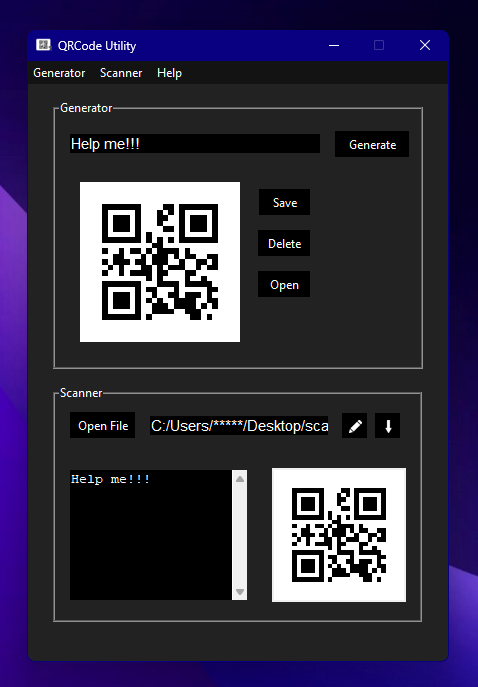
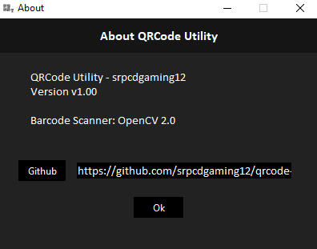

	
		
Easy to use graphical user interface and install for managing various types of barcodes.

		
		
		 
		 
		
	 
    
    
     

# License
   - QRCode Utility is licensed through <a href="https://mit-license.org/">MIT License</a>.

 

# Announcements
   ### Version v1.10
   - Added Scan Button on Generator:
     - Scanning after Generating QRCodes
   - Added Delete Button on Scanner:
     - Empties the Scanner
     
 

# Install
   1. Make sure you have [Python 3.11](https://www.python.org/downloads/release/python-3111/) installed.
   2. Requires Windows 7-11
   3. Requires [Git](https://git-scm.com/download/win)
   4. Open the build batch file.
   5. Press Y to build the application.
   6. After it's finished, go to the dist folder, and open the executable file.

 

  
  

